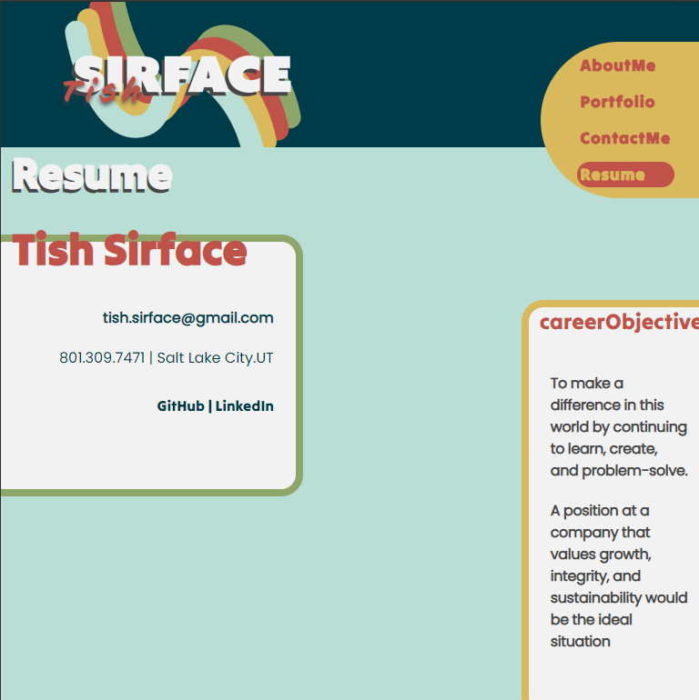

# **Portfolio of Tish**

## 📰 Description

My portfolio to display who I am and what I can do

## 🔎 Table of Contents

- [Installation](#installation)
- [Usage](#usage)
- [Contributing](#contributing)
- [Questions](#questions)
- [License](#license)

## 💾 Installation 

visit the site [Tish Sirface's Portfolio](https://tish-sirface-portfolio.netlify.app/)

## 🖱️ Usage 

Visit https://tish-sirface-portfolio.netlify.app/

## 🌐 Contributing 

Suggestions welcome. Please email or submit issue.

## ❔ Questions 

If you have any questions, feel free to contact me at:

- *GitHub: [ThisTish](https://github.com/ThisTish)*
- *Contact: tish.sirface@gmail.com*

## 🪪 License 

MIT License

        Copyright 2024 Tish Sirface

        Permission is hereby granted, free of charge, to any person obtaining a copy of this software and associated documentation files (the “Software”), to deal in the Software without restriction, including without limitation the rights to use, copy, modify, merge, publish, distribute, sublicense, and/or sell copies of the Software, and to permit persons to whom the Software is furnished to do so, subject to the following conditions:
        
        The above copyright notice and this permission notice shall be included in all copies or substantial portions of the Software.
        
        THE SOFTWARE IS PROVIDED “AS IS”, WITHOUT WARRANTY OF ANY KIND, EXPRESS OR IMPLIED, INCLUDING BUT NOT LIMITED TO THE WARRANTIES OF MERCHANTABILITY, FITNESS FOR A PARTICULAR PURPOSE AND NONINFRINGEMENT. IN NO EVENT SHALL THE AUTHORS OR COPYRIGHT HOLDERS BE LIABLE FOR ANY CLAIM, DAMAGES OR OTHER LIABILITY, WHETHER IN AN ACTION OF CONTRACT, TORT OR OTHERWISE, ARISING FROM, OUT OF OR IN CONNECTION WITH THE SOFTWARE OR THE USE OR OTHER DEALINGS IN THE SOFTWARE.

## 🙌 Acknowledgements 

- [react](https://www.npmjs.com/package/react): A JavaScript library for building user interfaces.
- [react-dom](https://www.npmjs.com/package/react-dom): The entry point of the DOM-specific rendering methods for React.
- [react-icons](https://www.npmjs.com/package/react-icons): A library that includes popular icons as React components.
- [react-router-dom](https://www.npmjs.com/package/react-router-dom): A collection of navigational components that compose declaratively with your application.
- [@emailjs/browser](https://www.npmjs.com/package/@emailjs/browser): A library for sending emails directly from the browser using EmailJS.
- [dotenv](https://www.npmjs.com/package/dotenv): A zero-dependency module that loads environment variables from a `.env` file into `process.env`.
- [vite](https://www.npmjs.com/package/vite): A next-generation frontend tooling for faster and leaner development.
- [autoprefixer](https://www.npmjs.com/package/autoprefixer): A PostCSS plugin which parses your CSS and adds vendor prefixes.
- [postcss](https://www.npmjs.com/package/postcss): A tool for transforming CSS with JavaScript.
- [tailwindcss](https://www.npmjs.com/package/tailwindcss): A utility-first CSS framework for rapidly building custom designs.
- [concurrently](https://www.npmjs.com/package/concurrently): A utility to run multiple commands concurrently.
- [eslint](https://www.npmjs.com/package/eslint): A fully pluggable tool for identifying and reporting on patterns in JavaScript.

## 📺 Screenshot

